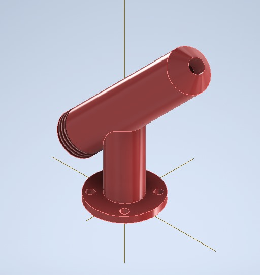
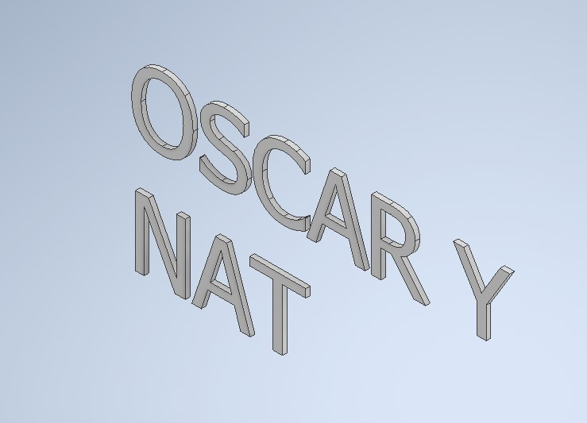
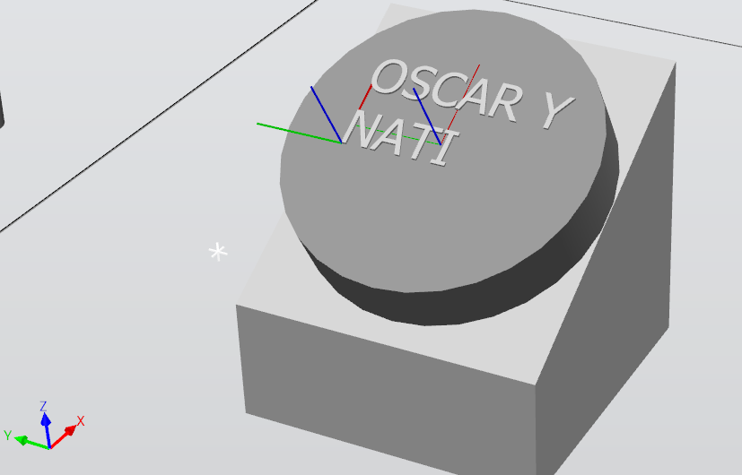
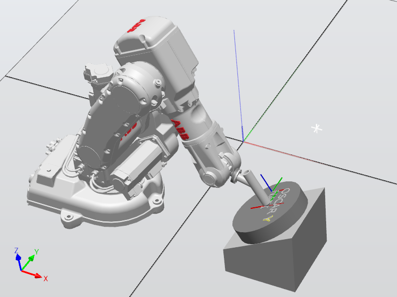
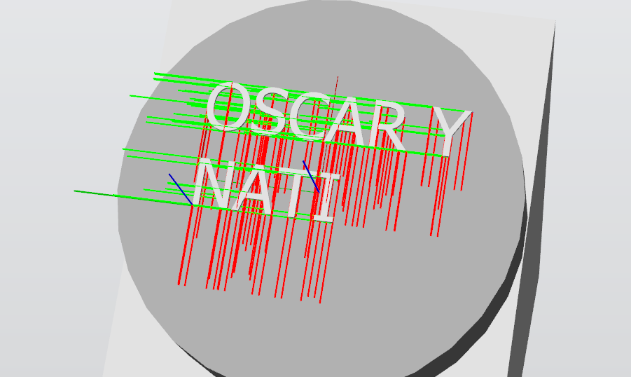
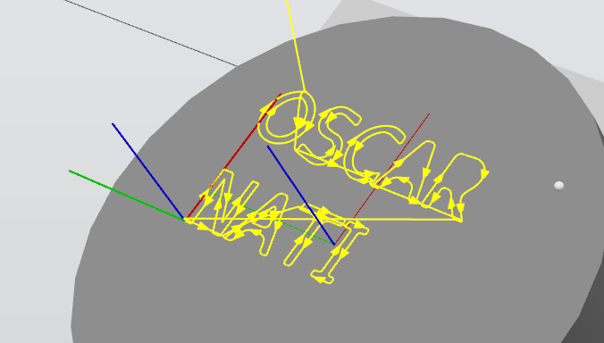
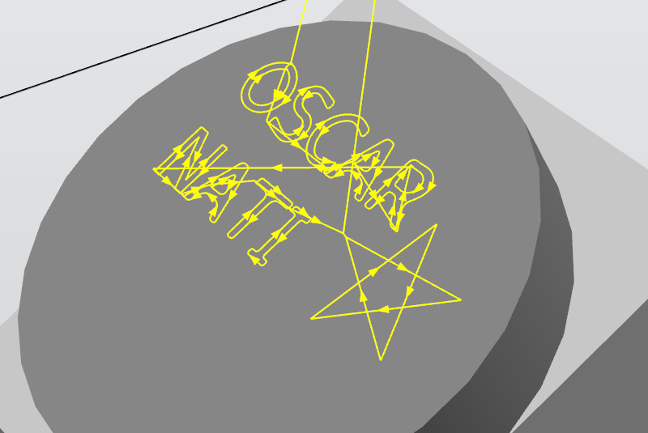

# Laboratorio 1

Grupo conformado por:\
**Oscar Andrés Alvarado Buitrago**\
**Natalia Cely Callejas**

## Diseño de la herramienta.

En el software *Autodesk Inventor* se diseñó el modelo 3D de la herramienta que sostendría el marcador, para lo cual se inició tomando las medidas de un marcador Expo genérico y creando la herramienta manteniendo los ejes de la base coincidentes con los ejes del flanche de montaje en RobotStudio, lo que permitió una simplificación en la unión entre los dos.\

Esta herramienta sigue las recomendaciones de un sistea de compensación por lo que se creó en dos piezas roscadas entre sí. Una base que sostendría el marcador y una tapa que contiene un sistema de resorte y un segundo fondo que permita que el marcador se ajuste a la posición y fuerza que ejerce el robot en cada momento.

## Diseño de las letras.

Para continuar, se creó un boceto en *Autodesk Inventor* con los nombres de los integrantes del grupo, separados como se solicitó, y se realizó su extrusión con 100 mm de profundidad. Para permitir un acercamiento con el manipulador y poder crear su trayectoria, se importó la geometria a RobotStudio y se unió a una plataforma en un ángulo de 30° sobre la cual se posicionó un cilindro que simulará la posición del pastel con un diámetro de 25 cm puesto que se proyecta para 25 personas.

Así, la escena total en RobotStudio incluyendo el manipulador, el controlador virtual, la herramienta o efector final, superficie de trabajo (pastel), mesa y las letras a recorrer se observan en la siguiente imagen.

Para esto, la base del manipulador se encuentra en las coordenadas (-269.17,-419.57,0), la mesa de trabajo se encuentra en la posición (230.25,-345.35,0) y su orientación se describe por medio de cuaterniones de la forma (0.7071,0,0,-0.7071) y las letras cuentan con una posición de (355.25,-391.38,230.95) y la orientación descrita por cuaterniones es (0.6830,0.1830,-0.1830,-0.6830).

## Diseño de las trayectorias.

Una vez todos los elementos necesarios se encontraban en la escena de RobotStudio, se inició a programar los diferentes puntos objetivo o targets de las letras por medio de la creación de targets por tabla.

Para esto, se tuvo en cuenta la alineación de los ejes y una rotación de 180° alrededor del eje Y tomando como referencia el sistema coordenado del WorkObject (Pastel). Una vez obtenidos los puntos de acercamiento, finalización y de recorrido de la trayectoria para cada una de las letras, se creó una sola trayectoriapara todos los puntos considerando que esto mejora la compatibilidad de configuraciones del robot para ejecutar dicha trayectoria.

Adicionalmente, debido al requerimiento de un carácter de decoración, se incluyó una estrella que consta de 5 puntos y se posicionó al lado de las letras. Así se obtiene la trayectoria final consolidada.

Posteriormente, en el módulo de *RAPID* se revisaron y codificaron las trayectorias y los movimientos del manipulador para cubrir los puntos esperados haciendo uso de algunas instrucciones fundamentales, como:
+ MoveL: Controla el movimiento lineal del TCP del efector final o herramienta configurada, dirigiéndolo a un punto deseado. Admite los argumentos como el punto destino, la velocidad, la zona de tolerancia, la herramienta y el objeto de trabajo utilizados y calibrados anteriormente.
+ MoveJ: Controla el movimiento del TCP del efector final o herramienta configurada, dirigiéndola a un punto deseado por medio del ovimiento articular de alguno de los ejes del robot. Admite los argumentos como el punto destino, la velocidad, la zona de tolerancia, la herramienta y el objeto de trabajo utilizados y calibrados anteriormente.
+ MoveC: Crea una instrucción de tipo movimiento circular que admite dos puntos, uno siendo el punto final del arco y otro un punto por donde debe pasar la trayectoria, asumiendo que el punto en donde se encuentra de forma inmediatamente anterior es el punto de incio del arco.
+ WaitDI: Genera un tiempo de "espera" indefinido y solo permite la continuación en las instrucciones una vez detecta un flanco (que puede ser positivo o negativo) en una señal digital definida como su parámetro.

Por medio de estas herramientas fue posible crear la secuencia de movimientos definida en dos partes en función de las entradas digitales externas, la implementación del módulo de entradas y salidas (I/O) permite introducir en el programa un factor de interaacción Humano-Máquina con el operario, lo que a su vez proporciona control y seguridad sobre las condiciones externas y físicas propias del entorno en el cual está trabajando el robot. La primera secuencia es activada por la señal "EntDI_1" que habilita el recorrido de la trayectoria de decoración, la cual incluye el carácter decorativo y las letras que conforman los nombres de los operarios; la segunda, por otra parte, se activa con la señal "EntDI_2" y activa una posición de mantenimiento que permite al operario remover y colocar la herramienta de trabajo.

Una vez descrito el funcionamiento del robot, es posible sintetizar sus acciones e instrucciones por medio de un diagrama de flujo como el siguiente:

## Resultados.

Por último, el funcionamiento se divide en las dos formas de trabajo que se espera obtener del manipulador en función de la inclinación del objeto de trabajo o pastel.

### En el plano a 0°.
Para este caso, se puede observar inicialmente el comportamiento del manipulador en el espacio siguiendo las dos secuencias de movimiento descritas anteriormente.

Y su comportamiento en detalle al momento de realizar la trayectoria de decoración sobre el pastel.

### En el plano a 30°.
Una vez la orientación del plano de trabajo cambia, se adaptan los valores de las trayectorias puesto que están definidos en función del WorkObject y así su replicación requiere únicamente la redefinición del objeto de trabajo. De la misma manera, inicialmente se observa el comportamiento en el espacio siguiendo las dos secuencias en función de las entradas digitales.

Y el detalle de movimientos sobre el pastel al describir la trayectoria de decoración.

En todos los casos anteriores es posible visualizar en detalle el comportamiento esperado del manipulador cumpliendo con las condiciones impuestas sobre su desempeño y con resultados exitosos, además de la implementación correcta del módulo de entradas y salidas, que le permite al robot una interacción con el operario de manera inmediata y brinda control sobre las acciones del manipulador para asgurar los entornos de seguridad que requiere la aplicación.