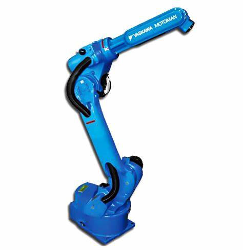
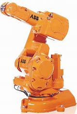
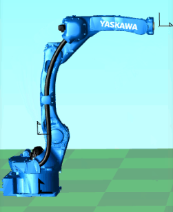
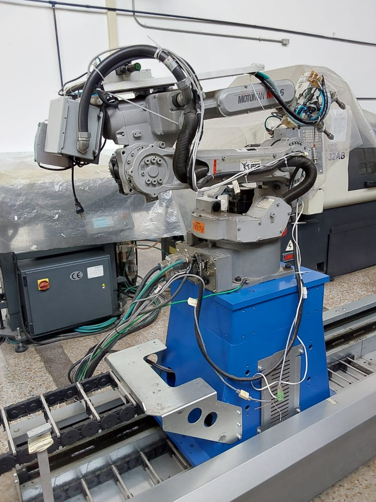
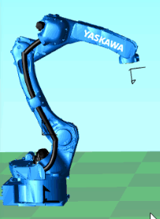
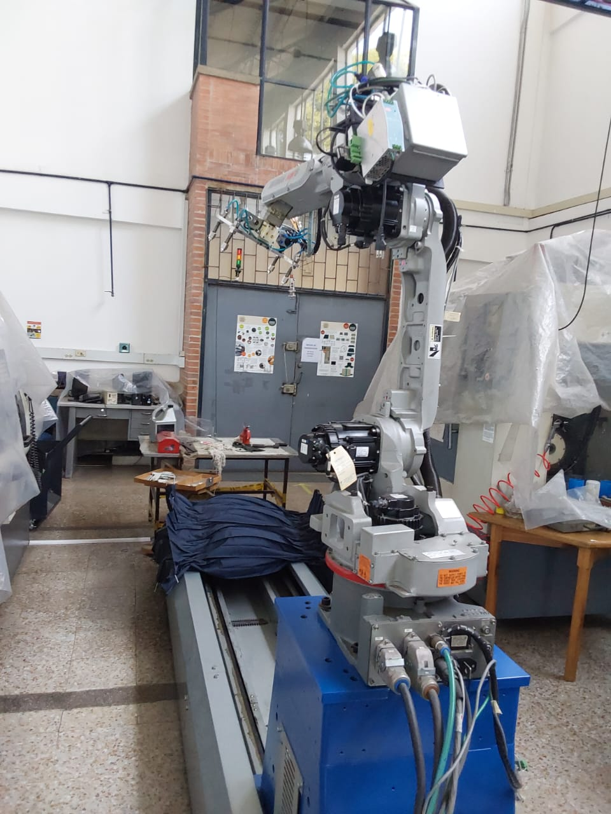
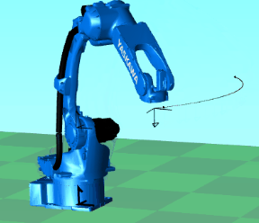
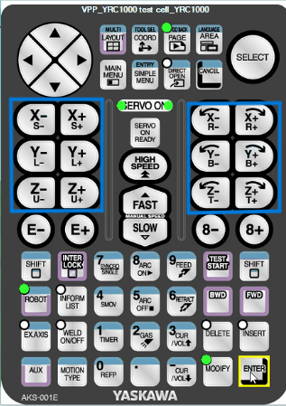
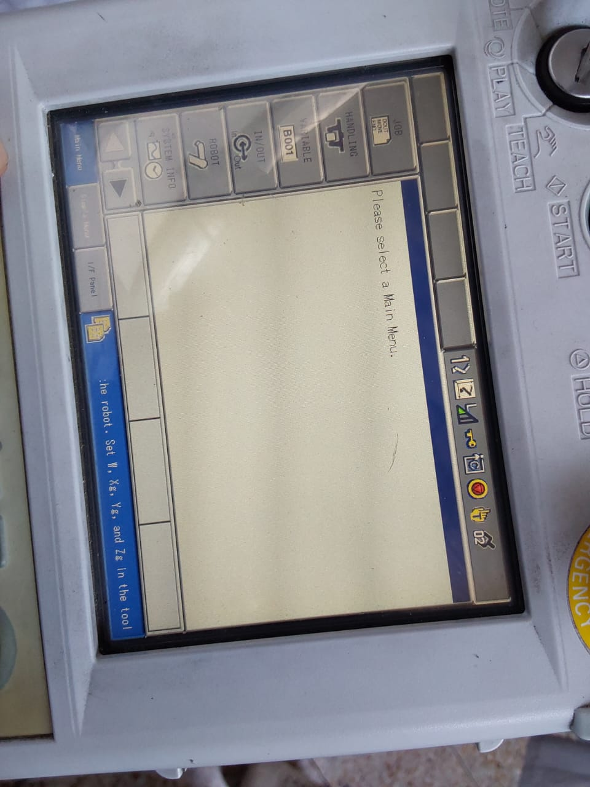

 # Laboratorio No. 02- Robótica Industrial- Análisis y Operación del Manipulador Motoman MH6: Comparativa y Aplicaciones Prácticas.
 El objetivo del presente laboratorio es entender las similitudes y diferencias entre diferentes modelos y fabricantes de manipuladores en el campo de la robótica industrial.
 En este caso, se inician con las diferencias en las especificaciones técnicas que se presentan entre el Motoman MH6 (Yaskawa) y el IRB140 (ABB).
## Especificaciones técnicas Motoman MH6 vs IRB140.

| Especificación               | Motoman MH6 | IRB140  |
|:----------------------------:|:-----------:|:-------:|
| Imagen de referencia         |  | 
| Número de ejes               | 6           | 6       |
| Carga máxima                 | 6 kg        | 5 kg    |
| Alcance de la 5 articulación | 1422 mm     | 810 mm  |
| Repitibilidad                | $\pm$ 0.08 mm | $\pm$ 0.03 mm|
| Masa del robot               | 130 kg      | 98 kg   |
| Consumo de potencia          | 1.5 kVA     | 4.5 kVA |
| **Rango de rotación de articulaciones**            |||
| Art. 1                       | 170°        | 360°    |
| Art. 2                       | 155°        | 200°    |
| Art. 3                       | 250°        | 280°    |
| Art. 4                       | 180°        | 400°    |
| Art. 5                       | 225°        | 240°    |
| Art. 6                       | 360°        | 800°    |
| **Velocidad de rotación de articulaciones**        |||
| Art. 1                       | 220°/s      | 200°/s  |
| Art. 2                       | 200°/s      | 200°/s  |
| Art. 3                       | 220°/s      | 260°/s  |
| Art. 4                       | 410°/s      | 360°/s  |
| Art. 5                       | 410°/s      | 360°/s  |
| Art. 6                       | 610°/s      | 450°/s  |
| **Torque máximo en articulaciones**        |||
| Art. 4                       | 11.8 Nm     | 8.58 Nm  |
| Art. 5                       | 9.8 Nm      | 8.58 Nm  |
| Art. 6                       | 5.9 Nm      | 4.91 Nm  |

##  Posiciones de Home para el Manipulador Motoman MH6.
El manipulador Motoman MH6 cuenta con dos posiciones de Home desde fábrica y una tercera denominada Work Home.
*Home 1*. Se trata de la posición inicial y de calibración del manipulador, normalmente no se recomiendo modificar o recalibrar esta posición con excepción de cambio en los encoders o motores. En el laboratorio SalaCAM de la Universidad Nacional de Colombia, esta posición se utiliza para guardar el manipulador en una posición conveniente y "recogida".

*Home 2*. Se  puede entender como un checkpoint, es una herramienta para restablecer la posición a una configuración en donde todos los ejes de articulaciones están alineados, en su mayoría en "0". Es posible modificar esta posición posterior a la instalación para recuperarse luego de errores como "Fuera de rango" o singularidades por alineación. En el laboratorio SalaCAM de la Universidad Nacional de Colombia, esta posición se utiliza para establecer la base de movimiento del manipulador, por lo que es una posición lista para iniciar movimiento y trabajo.

*Work Home*. Por default se encuentra coincidente con la posición de Home 2, sin embargo presenta también la posibilidad de ser personalizada, su propósito es crear una pocisión que ayuda en las tareas específicas necesaria para mejorar la maniobrabilidad de acuerdo con la aplicación deseada.

## Control del movimiento manual (Jogging).
En la interfaz manual HMI, teach pendant, se encuentran 6 teclas a la izquierda y a la derecha que permiten controlar el movimiento linear del efector final en cada uno de los 3 ejes, cada uno en los sentidos positivo y negativo; si por lo contrario la configuración se encuentra en movimiento articular, las 12 teclas controlaran el movimiento de cada una de las articulaciones en los sentidos positivo y negativo.

Para realizar el cambio entre el movimiento linear y articular, se utiliza la tecla *MOTION TYPE* en el teach pendant y en la pantalla se observ el tipo de movimiento que se encuentra seleccionado.

## Configuraciones de Velocidad.
El comando *SPEED* permite configurar la velocidad de reproducción de los movimientos programados, admite la diferenciación entre velocidad articular *"VJ=..."*, velocidad del TCP *"V=..."*, velocidad de reprodcción de posición *"VR=..."*, y de reproducción del eje externo *"VE=..."*. Por lo general la confiugración de este parámetro se da en la misma línea de comando que el comando de movimiento con el que se controla el movimiento del manipulador. Para la modificación de este parámetro solo hace falta escoger el valor en el código que se desea modificar y reescribir el nuevo valor.

En la pantalla del Teach Pendant, en la barra superior se encuentra una gráfica de un triángulo dividido en tres, similar al utilizado en dispositivos móviles para reconocer el nivel de señal en el que se encuentra. Esto se puede controlar por medio de las teclas *FAST* y *SLOW* en el centro del teach pendant.

## Aplicaciones principales de RoboDK

RoboDK es una herramienta poderosa y versátil con aplicaciones en diversos campos de la industria:

* **Simulación y programación offline**: Permite crear programas de robot en un entorno virtual, sin necesidad de detener la producción. Esto ahorra tiempo y costos, además de minimizar el riesgo de errores y colisiones.
* **Optimización de trayectorias**: RoboDK ofrece herramientas para optimizar las trayectorias del robot, lo que se traduce en movimientos más eficientes, ciclos de trabajo más cortos y mejor calidad en el acabado de las piezas.
* **Análisis de factibilidad**: Permite evaluar la viabilidad de un proyecto robótico antes de la implementación real. Se pueden simular diferentes escenarios y configuraciones para determinar la mejor solución.
* **Generación de código para múltiples robots**: RoboDK es compatible con una amplia gama de marcas y modelos de robots, lo que facilita la programación y el control de diferentes sistemas robóticos con un solo software.
* **Calibración de robots**: Ayuda a mejorar la precisión de los robots industriales mediante procesos de calibración.

## Comunicación con el manipulador

RoboDK se comunica con el manipulador Motoman MH6 a través de una conexión TCP/IP. El software genera un programa en el lenguaje de programación del robot (en este caso, probablemente INFORM II para Motoman) y lo transmite al controlador del robot. El controlador interpreta las instrucciones y las ejecuta, moviendo el robot según lo programado.

## ¿Qué hace RoboDK para mover el manipulador?

RoboDK no "mueve" directamente el manipulador. Su función principal es generar el programa que el robot ejecutará. RoboDK:

1. **Crea el modelo virtual del robot y la celda de trabajo**: Define la geometría del robot, sus límites de movimiento y la disposición de los objetos en el entorno de trabajo.
2. **Permite crear trayectorias y operaciones**: El usuario define los movimientos que debe realizar el robot, ya sea manualmente o importando modelos CAD y generando trayectorias automáticamente.
3. **Simula la ejecución del programa**: RoboDK permite visualizar la simulación de los movimientos del robot para detectar posibles errores o colisiones.
4. **Genera el código de programa**: Traduce las trayectorias y operaciones definidas en un programa en el lenguaje de programación del robot.
5. **Transfiere el programa al controlador**: El programa generado se carga en el controlador del robot, que se encarga de ejecutar las instrucciones y controlar los movimientos del manipulador.

## Diferencias entre RoboDK y RobotStudio

Tanto RoboDK como RobotStudio son herramientas de simulación y programación offline de robots industriales, pero presentan diferencias clave en compatibilidad, funcionalidad y aplicaciones.  

## Ventajas y Aplicaciones  

### RobotStudio (ABB)  
**Ventajas:**  
- Integración total con robots ABB.  
- Simulación realista con acceso a librerías y controladores oficiales.  
- Soporta AR/VR para entornos virtuales avanzados.  
- Permite programar, depurar y probar código RAPID sin necesidad de hardware.  

**Aplicaciones:**  
- Empresas que trabajan exclusivamente con ABB.  
- Desarrollo de células robóticas avanzadas con herramientas especializadas.  
- Programación detallada de ciclos de producción en entornos ABB.  

**Limitaciones:**  
- Incompatible con robots de otras marcas.  
- Licencia costosa, lo que puede ser una barrera para pequeñas empresas o educación.  

### RoboDK (Multimarca)  
**Ventajas:**  
- Compatibilidad con múltiples marcas de robots como ABB, KUKA, Yaskawa y FANUC.  
- Soporte para diversos lenguajes de programación y APIs.  
- Interfaz intuitiva y fácil de usar para principiantes y expertos.  
- Mayor flexibilidad en exportación de programas y simulaciones.  

**Aplicaciones:**  
- Empresas y centros de investigación que trabajan con diferentes marcas de robots.  
- Educación y formación, gracias a su interfaz amigable y versión gratuita.  
- Generación de trayectorias y simulaciones rápidas sin depender de software propietario.  

**Limitaciones:**  
- Aunque es compatible con ABB, no ofrece la misma integración profunda que RobotStudio.  
- Menos herramientas avanzadas específicas de cada fabricante.  

# Programación Trayectoria de Lemniscata en Motoman H6 con RoboDK  

Este repositorio contiene un script en Python para programar un robot **Motoman H6** en **RoboDK**, generando una trayectoria en forma de **lemniscata** llamado [Lemniscata.py](Lemniscata.py)

##  Características  
✅ Programación en Python con la API de RoboDK.  
✅ Generación de una trayectoria continua y fluida.  
✅ Implementación de dos lemniscatas perpendiculares.  
✅ Compatible con robots físicos Motoman H6.  

---

##  Requisitos  

###  Software  
- **RoboDK** (última versión recomendada)  
- **Python 3.x** (con la API de RoboDK instalada)  

### Hardware  
- **Robot Motoman H6** (real o simulado en RoboDK)  
- Controlador **DX100/DX200/YRC1000** para implementación física.  

---
## Video de simulacion: 
[Ver simulacion](2025-02-07-20-19-32.mp4)

## Referencias.
+ [Documento con las especificaciones técnicas del Manipulador Motoman MH6.](https://pdf.directindustry.com/pdf/motoman/motoman-mh6-series-robots/14474-97220-_2.html)
+ [Documento con las especificaciones técnicas del Manipulador ABB IRB140.](https://library.e.abb.com/public/73e6655d65ab9569c1257b440052382f/IRB%20140%20datasheet.pdf)
+ [Información del Foro Knowledge Motoman sobre las posiciones de Home](https://knowledge.motoman.com/hc/en-us/articles/4415152176791-Home-Position-Second-Home-Position-and-Work-Home-Position)
+ Manual de referencia para controlador DX100. Motoman.
