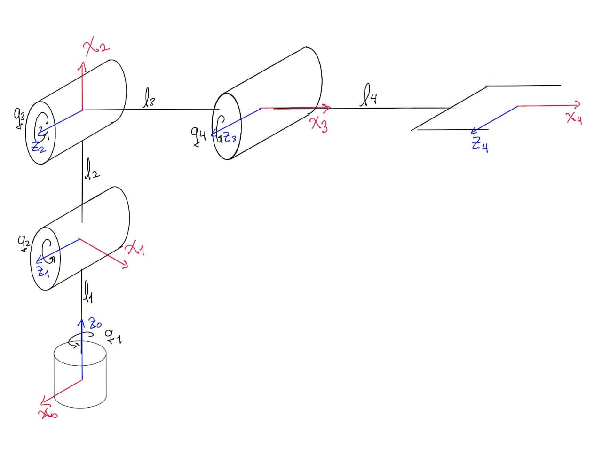
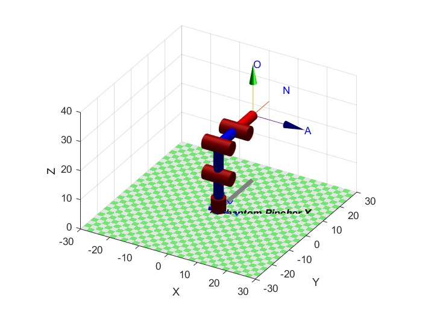
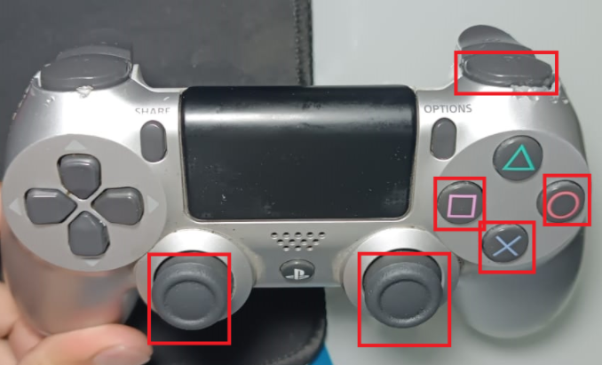
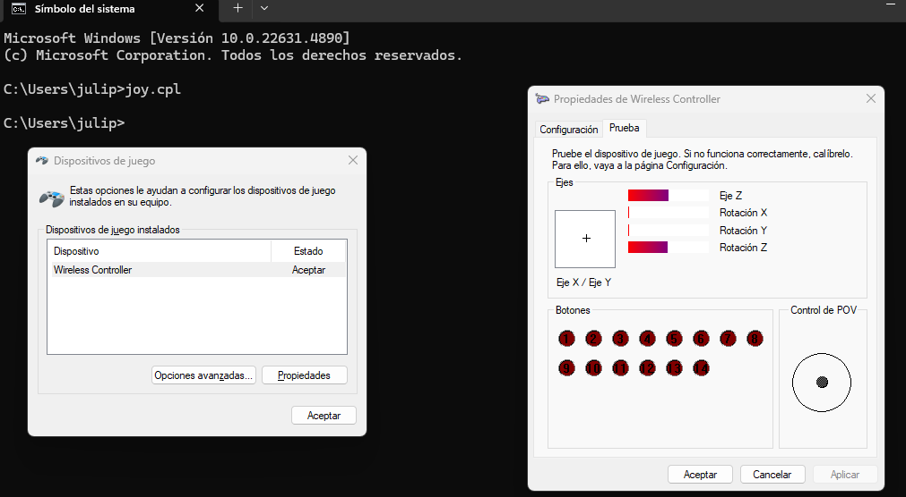
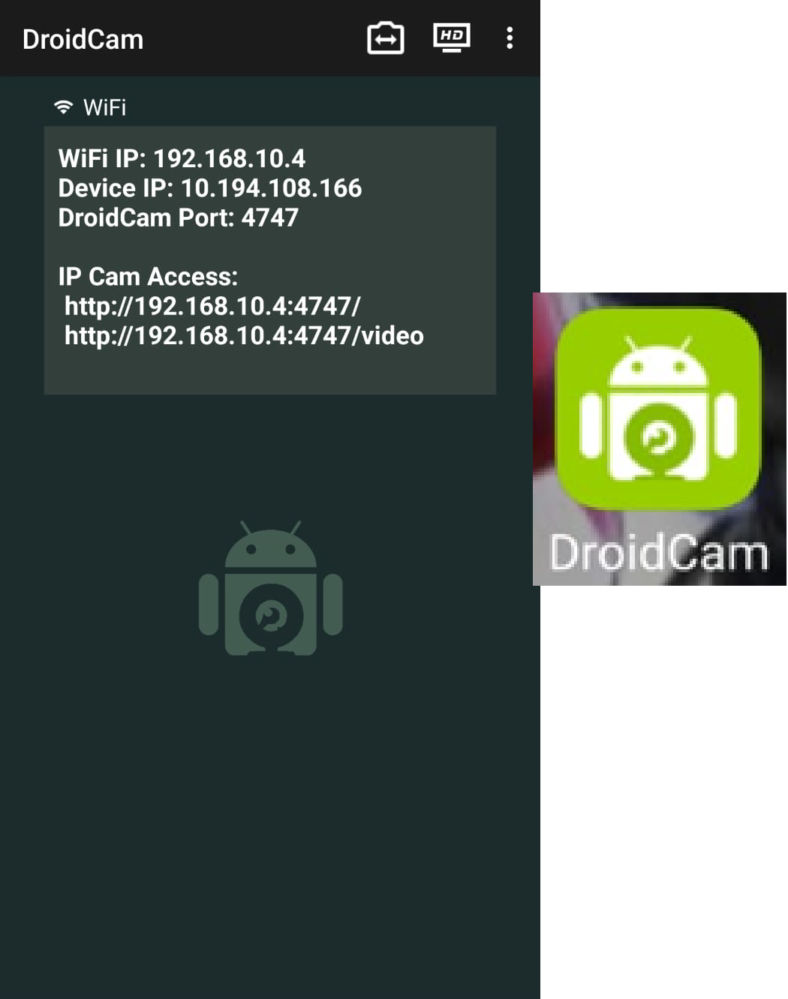
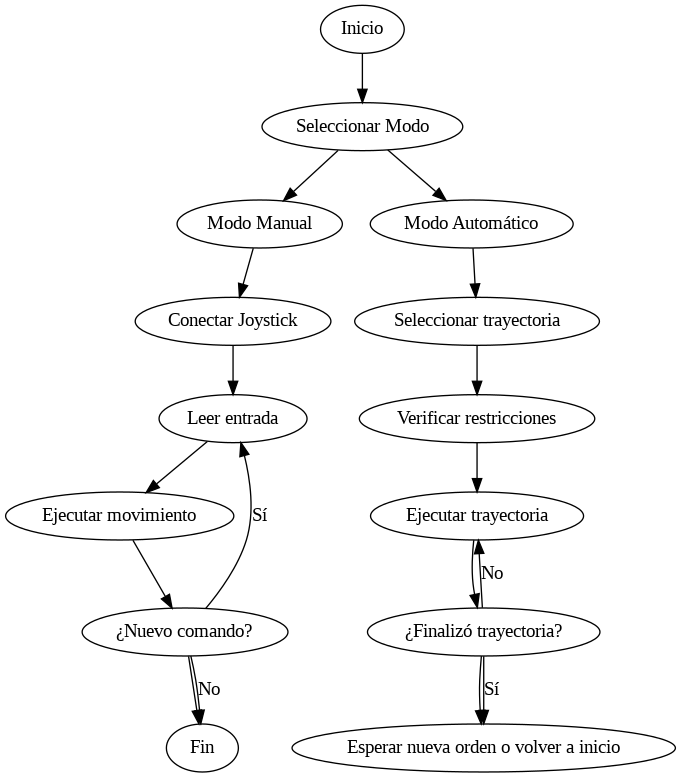

# Proyecto Final de Robótica - Sistema de Teleoperación

## Descripción del Proyecto
Este proyecto consiste en el desarrollo de una aplicación de teleoperación utilizando el robot **Phantom X Pincher** para realizar tareas de **Pick & Place** en dos modos de operación: 
- **Automático**: con trayectorias preprogramadas.
- **Manual**: mediante un joystick en tiempo real.

El sistema se basa en una conexión **LAN** entre dos computadoras:
- **Zona Local (Maestro)**: donde el operador controla y supervisa la operación.
- **Zona Remota (Esclavo)**: donde se encuentra el robot físico ejecutando los comandos.

La implementación se desarrolla con **ROS2**, utilizando herramientas como **Matlab, Dynamixel Wizard y diversos paquetes ya creados en ROS2**.

## Análisis - Cinemática directa del Manipulador.
A partir de mediciones se extrajeron los parámetros de Denavit-Hartenberg correspondientes a la cinemática directa del **Phantom X Pincher**. Inicialmente con una representación gráfica basada en mediciones.


| $i$ | $d_i$ | $\theta_i$ | $a_i$ | $\alpha_i$ | Offset |
|---|---|---|---|---|---|
| 1 | $L_1$ | $q_1$ | $0$ | $\pi/2$ | $\pi/2$ |
| 2 | $0$ | $q_2$ | $L_2$ | $0$ | $\pi/2$ |
| 3 | $0$ | $q_3$ | $L_3$ | $0$ | $-\pi/2$ |
| 4 | $0$ | $q_4$ | $L_4$ | $0$ | $0$ |

Cuyos valores numéricos son: L₁ = 12 cm    L₂ = 10.5 cm    L₃ = 10.5 cm    L₄ = 10 cm

Esto a su vez permitió crear el archivo descriptor del robot para que su visualización eventual en entornos como MATLAB, Coppelia y Rviz corresponda al manipulador físico. Los cálculos fueron comparados con las posiciones esperadas, sin embargo, su comprobación final se produce en el control automático.



## Análisis - Cinemática inversa

Una vez obtenida la matriz de transformación homogénea (MTH), se implementa la función invkin en MATLAB. Esta función calcula las posiciones articulares necesarias para que el efector final del robot alcance una posición deseada en el espacio cartesiano (x, y, z). Recibe como entradas las coordenadas cartesianas, las longitudes de los eslabones (L₁, L₂, L₃, L₄) y el ángulo de alcance (φ).

### Proceso de cálculo

La función utiliza un enfoque geométrico basado en la ley de senos y la ley de cosenos para determinar las posiciones articulares. El proceso se divide en los siguientes pasos:

1. *Ángulo base (q₁):*
   
q₁ = rad2deg(atan2(y, x)) - 90°

2. *Posición del efector sin la herramienta:*
   
pwx = sqrt(x² + y²) - l₄  cos(φ)  
pwz = z - l₄  sin(φ) - l₁

3. *Distancia al punto objetivo (r):*
   
r = sqrt(pwx² + pwz²)

4. *Ángulo q₃ (Ley de cosenos):*
   
D = (r² - l₂² - l₃²) / (2  l₂ l₃)  
q₃ = rad2deg(atan2(-sqrt(1 - D²), D)) + 90°

5. *Ángulo q₂ (Ley de senos y cosenos):*
    
α = atan2(pwz, pwx)  
β = atan2(l₃ sin(q₃ - 90°), l₂ + l₃  cos(q₃ - 90°))  
q₂ = rad2deg(α - β) - 90°

6. *Ángulo q₄ (Herramienta):*
    
q₄ = φ - q₂ - q₃

7. *Retorno de las posiciones articulares:*
q = [q₁, q₂, q₃, q₄]
### Implementación en MATLAB

```matlab
function q_sim = invkin(x, y, z, l1, l2, l3, l4, phi)
    % Ángulo base
    q1 = rad2deg(atan2(y, x)) - 90;

    % Posición del efector sin la herramienta
    pwx = sqrt(x^2 + y^2) - l4 * cosd(phi);  
    pwz = z - l4 * sind(phi) - l1;  

    % Distancia al punto objetivo
    r = sqrt(pwx^2 + pwz^2);

    % Ángulo q3 (Ley de cosenos)
    D = abs(r^2 - l2^2 - l3^2) / (2 * l2 * l3);
    q3 = rad2deg(atan2(-sqrt(abs(1 - D^2)), D)) + 90;  

    % Ángulo q2 (Ley de senos y cosenos)
    alpha = atan2(pwz, pwx);
    beta = atan2(l3 * sind(q3 - 90), l2 + l3 * cosd(q3 - 90));
    q2 = rad2deg(alpha - beta) - 90;

    % Ángulo de la herramienta
    q4 = phi - q2 - q3;

    % Retornar ángulos articulares
    q_sim = [q1, q2, q3, q4];
end
```

## Descripción de la solución y análisis del código

La solución fue implementada utilizando ROS2 Humble en Windows, por medio de RoboStack. Previo a la programación, se estudiaron los registros que poseen los servos AX-12A, que son lo utilizados por el robot PincherX-100. Dichos registro se pueden consutal en la tabla de control, que se encuentra en la [página web](https://emanual.robotis.com/docs/en/dxl/ax/ax-12a/#control-table-data-address) del fabricante, y permiten leer y escribir sobre los registros de los dispositivos. Adicionalmente, se utilizó el software Dynamixel Wizard 2, para verificar el estado de los motores.

### Implementación en ROS2 Humble


#### Phantom Controller

Al nodo principal del workspace referente al proyecto, se le ha designado el nombre de *phantom_controller* y fue implementado con *ament_python* con el fin de realizar la implementación del controlador en Python. Éste se encarga de comunicarse con los servos, realizando funciones como la activación de torques y la fijación de tanto posiciones como velocidades objetivo. Para ello, se ha importado la libería *dynamixel_sdk* en el archivo correspondiente al nodo. Para comenzar con la configuración de los motores, se instancian dos objetos con clases *PortHandler* y *PacketHandler*, las cuales se encargan de el manejo del puerto en donde esté conectado el conversor U2D2 y de la lectura y escritura de paquetes, respectivamente. 

https://github.com/natc27/Robotica/blob/0de8620d91547bff2e10a3186a70adac67408662/Project/Phantom_ws/src/phantom_controller/phantom_controller/phantom_controller.py#L49-L51

Posteriormente, se utilizan los miembros *openPort*  y *setBaudRate* del objeto *portHandle* para abrir el puerto y fijar la tasa de baudios correspondiente. Para leer datos de los registros, se utiliza la función el miembro *read2ByteTxRx* (o *read4ByteTxRx*, dependiendo del tipo de dato que almacena el registro) del objeto *packetHandler*.

https://github.com/natc27/Robotica/blob/4102386d516958b52753ce6bb3deca950aa36fa6/Project/Phantom_ws/src/phantom_controller/phantom_controller/phantom_controller.py#L167-L173

Es necesario especificar un objeto tipo *PortHandler*, la ID del motor cuyo registro va a ser accedido y la dirección del registro. En este caso, se debe llamar a la función iterativamente para leer las posiciones de todos los motores y almacenarlas en un arreglo. Es posible utilizar de manera similar los miembros *read2ByteTxRx* y *read4ByteTxRx* para escribir información en los registros. Sin embargo, para realizar un Sync Write (es decir, escribir información a todos los motores al mismo tiempo) es necesario utilizar objetos de clase *GroupSyncWrite*.

https://github.com/natc27/Robotica/blob/5042ef6418d4194b9bc805ce40402f7f42fe35c4/Project/Phantom_ws/src/phantom_controller/phantom_controller/phantom_controller.py#L87-L89

Posteriormente, se utiliza el miembro *addParam* de la misma clase para añadir la información a ésta. Finalmente, envía la información utilizando el miembro *txPacket* y se limpia el objeto con el miembro *clearParam*.

https://github.com/natc27/Robotica/blob/8fbe2d26b156bf28dd0d25169aa4f19af39d298c/Project/Phantom_ws/src/phantom_controller/phantom_controller/phantom_controller.py#L152-L158

Adicionalmente se tienen dos publisher, que constantemente publican información del estado del robot a los nodos */curr_joint_pos* y */curr_joint_vel*, y dos subscriber, que se encargan de recibir la información de los nodos */goal_joint_vel* y */goal_joint_vel*, para posteriormente enviar la información de las posiciones objetivo a los robots.

#### Phantom Kinematics

El nodo *phantom_kinematics*, se encarga de enviar mensajes a los nodos */goal_joint_vel* y */goal_joint_vel*, que se encargan de publicar la posición y velocidad objetivos de los servos al nodo *phantom_controller*. Además, éste nodo establece la conexión con el joystick, al recibir las diferentes entradas de cada acción del control.

#### Joy Mapper
El nodo joy mapper es un nodo que filtra los contenidos del nodo de lectura Joy. El desarrollo se enfoco para el uso de un mando de DualShock4 de PlayStation 4, pero es posible adaptarlo para otros controladores que hagan uso de joysticks. En la imagen aparecen resaltados los joysticks y botones que se usaron.



En primera instancia, se verifico no solo la conexion de los botones mediante la *Consola de Comandos* sino tambien cuantas señales se pueden reconocer del mando. Para esto se ejecuta el comando *joy.cpl*, en donde se despliega el menu *Dispositivos de juego*. Si el mando es reconocido debe aparecer listado y en estado activo. Posterior, accedemos al menu de propiedades, en este menu podemos ver 3 secciones:

1. **Ejes**: Referentes a las señales anaologas que puede registrar el mando. En el caso del mando DualShock4, son los datos de los 2 JoySticks analogos y de los gatillos L2 y r2.

2. **Botones**: Refrentes a todas las señales digitales binarias que puede registrar el mando. En el caso del mando DualShock4, hay 14 incluyendo botones ocultos como el de los JoySticks y el de pad tactil.

3. **Control de POV**: Refrente exclusivamente a la cruzeta o pad de deirecciones.





Comproba loa seañles que dispones para operar, hay que cerciorase de que en nuestro entrono de ROS2 este instalado el paqueste ros-humble-joy, ya que este es el que nos permita realizar la conexion directa entre ROS y nuestro mando. Como se puede ver, cualquier nodo de ROS puede acceder al mando de forma directa, pero esto implica 2 problemas: el tamaño de paquete dependera del mando usado y si no se tiene la correcta caracterizacion del mando no se sabe que señales son analogas, digitales, de los joysticks, de los botoens, etc... Por lo que es aconseble crear un nodo que filtre esta informacion cruda para que el resto de nodos en la red ROS no tenga incivenientes.

Hbalando del codigo del nodo. Con el fin de facilitar el proceso de caracterizado y compilacion del nodo, se hace uso de un archivo de configuracion **yaml** para dar  mayor adaptabilidad al poder declarar y permitir que el nodo sea independeniente del hardware del mando.

https://github.com/natc27/Robotica/blob/16925ed3875dbbcfb20b03f7069fddddad7b0491/Project/Phantom_ws/src/joy_mapper/dualshock4_teleop.yaml#L1-L5

Por defecto, este nodo adquiere y filtra los datos de todos los ejes analogos y de 4 botones, de los cuales solo usamos 4 señales analogas y 3 digitales (se dejaron señales libres en caso de ser encesarias). La asignacion de variables que usamos fue la siguiente:

1. Eje x equivalente al movimiento horizontal de stick izquierdo y controla la artiuclacion 1.
2. Eje y equivalente al movimiento vertical de stick izquierdo y controla la artiuclacion 2.
3. Eje z equivalente al movimiento horizontal de stick derecho y controla la artiuclacion 3.
4. Rotacion z equivalente al movimiento vertical de stick derecho y controla la artiuclacion 4.
5. Boton 2 equivalente al boton **X** y controla el cierre del griper (Articulacion 5).
6. Boton 3 equivalente al boton **Circulo** y controla la apertura del griper (Articulacion 5).
7. Boton 10 equivalente al boton **R1** y actua como boton de hombre muerto por seguridad.

Con esta configuracion inicial establecida, realizamos la subcripcion al nodo **Joy** (debe estar activo) para publicar 3 temas: Un arreglo con los datos de los ejes, un arreglo con los datos de los botones y por aparte el boton de hombre muerto.

https://github.com/natc27/Robotica/blob/16925ed3875dbbcfb20b03f7069fddddad7b0491/Project/Phantom_ws/src/joy_mapper/joy_mapper/joy_to_twist.py#L21-L23

Y hay 2 funciones importantes que cumple **joy_mapper**: Primero filtar la señales analogas con un filtro basico.

https://github.com/natc27/Robotica/blob/16925ed3875dbbcfb20b03f7069fddddad7b0491/Project/Phantom_ws/src/joy_mapper/joy_mapper/joy_to_twist.py#L25-L32

Y segundo, permite la publicaion o no del tema **filtered_axes** mediante el valor de **R1**, con el fin de evitar errores causados por el usuario remoto o por drift del los sticks analogos.

https://github.com/natc27/Robotica/blob/16925ed3875dbbcfb20b03f7069fddddad7b0491/Project/Phantom_ws/src/joy_mapper/joy_mapper/joy_to_twist.py#L34-L36

Un aspecto a mejorar para proximas versiones tiene que ver con en **yaml** para quede ademas de permitir configurar la distribucion de botones, permita decidir que señales usar y cuales no dando la mayor soporte de hardware.


#### DroidCam Publisher
Es un nodo que con ayuda de la aplicacion **DroidCam** (disponible en PlayStore) puede convertir cualquier smartphone en una camara inhalambrica a la que se puede acceder medinate IP. La aplicacion es muy simple de usar, basat con abrirla y ya el smartphones empieza a operar como web. Cabe aclarar que existe una version paga de la app llamada **DroidCamX** que ademas de dar mas psoibilidades de configuracion, da la opcion de operara el smartphone como camara USB. Por practicidad, se hizo uso de la version gratuita. Lo mas importante es verificar que la direccion IP de la camara este en la misma red que el resto hardware. 



En caunto al nod ROS, este requiere la dependencia **cv_bridge** de python paar realizar la conexion, por lo cual es pertinente tener la instalada en el entorno activo de ROS. Ademas de que igual que con **joy_mapper**, se usa un archivo **yaml** para configurar la direccion IP y el numero de fotogramas del video, y optimizar la funcion del nodo.

https://github.com/natc27/Robotica/blob/6620f874eabcf2e7e8dbd53e8d45366211d3b4bb/Project/Phantom_ws/src/droidcam_publisher/droidcam_params.yaml#L1-L2

#### DroidCam Listener

## Diagrama de flujo de las acciones del robot

A continuación, se muestra el diagrama de flujo del funcionamiento general del robot, en donde se colocan las acciones principales del robot, es decir, el modo manual y automático.


## Autores
- Oscar Andrés Alvarado.
- Natalia Cely.
- Omar Pérez.
- Julián Pulido.

---
© 2025 - Universidad Nacional de Colombia. Proyecto desarrollado en el curso de Robótica 2024-II.
